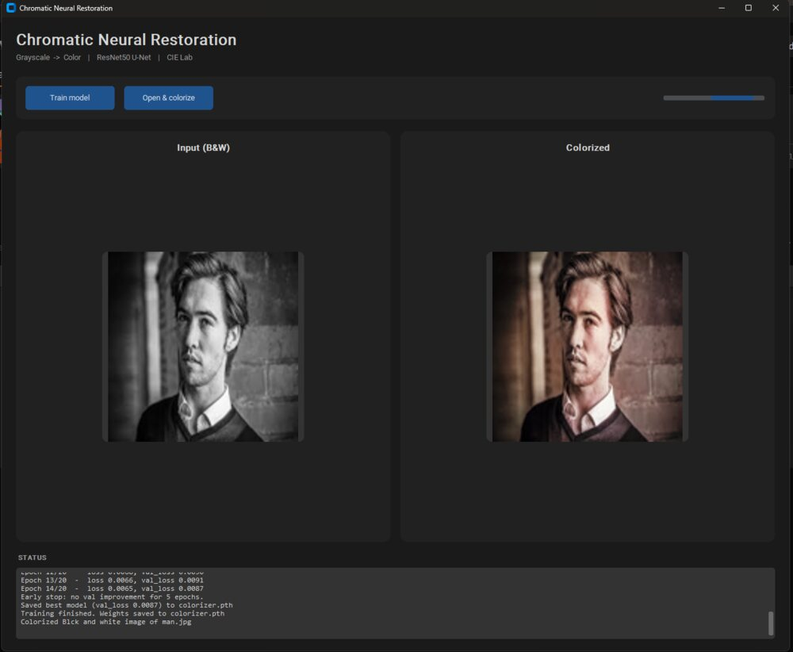
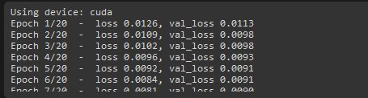
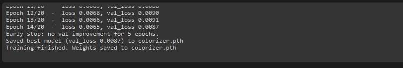
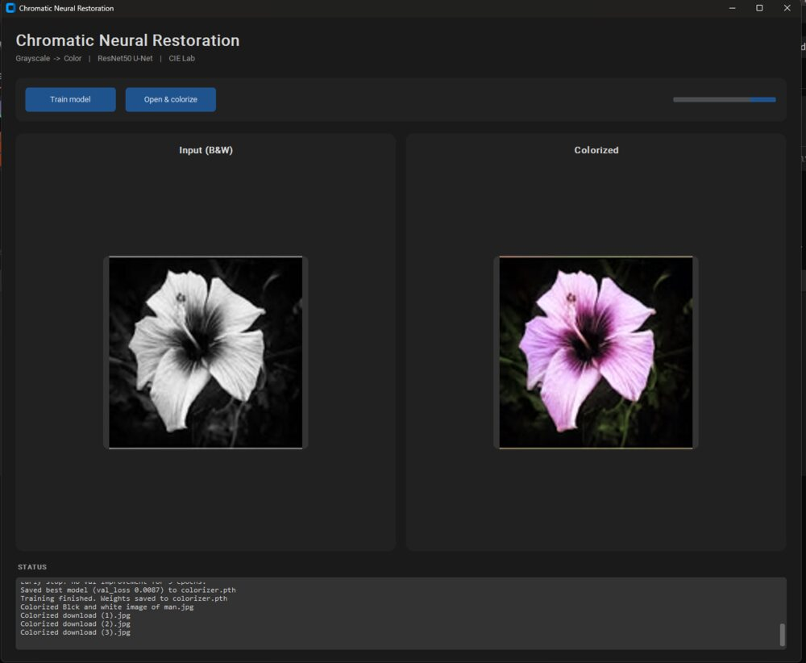
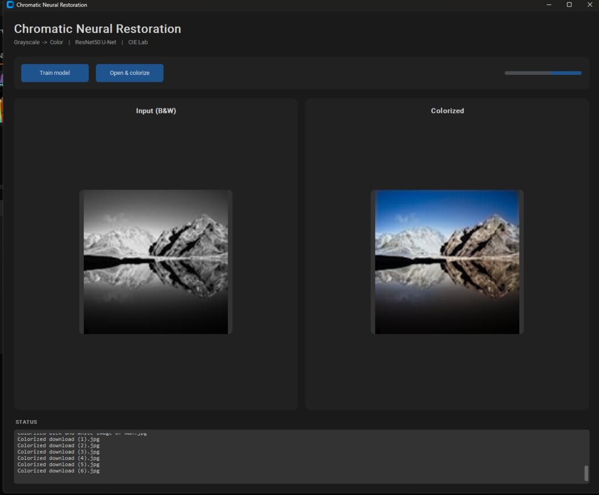
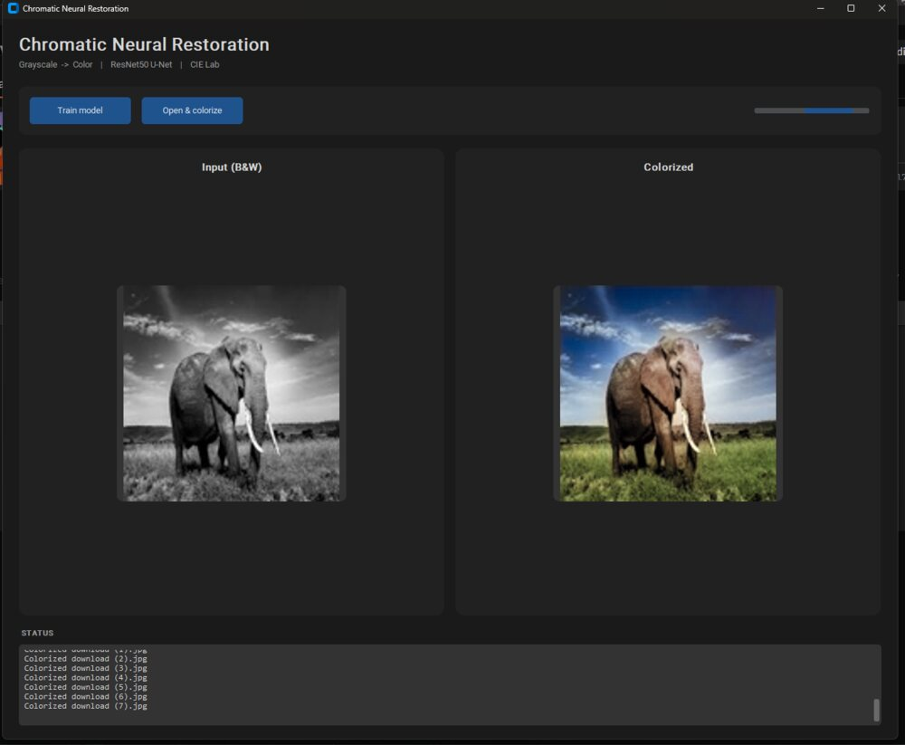
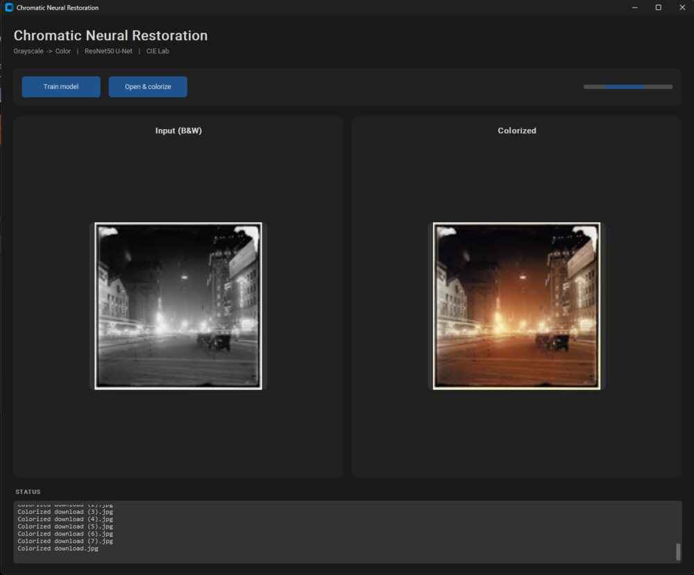
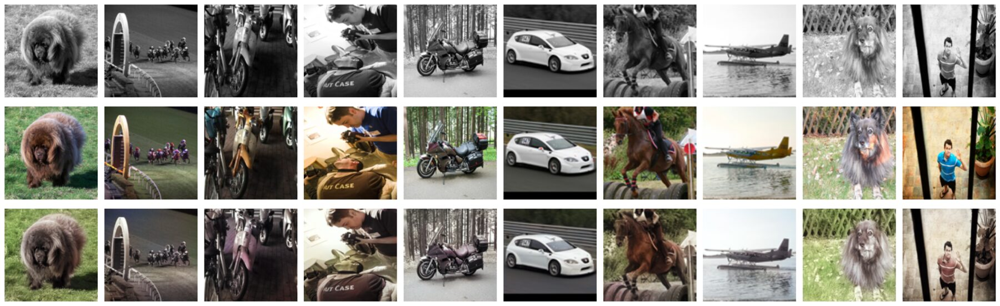

# Chromatic Neural Restoration

A PyTorch image-colorization application that predicts the CIE Lab `a` and `b` channels from a grayscale luminance channel. The project combines a pretrained ResNet-50 encoder, a U-Net-style decoder, a mixed-domain data pipeline, checkpointed training, quantitative evaluation, and an interactive CustomTkinter desktop interface.



## Verified Training Result

| Item | Result |
| --- | --- |
| Device | NVIDIA GeForce RTX 4090 through CUDA |
| Maximum epochs | 20 |
| Completed epoch | 14 |
| Early-stopping patience | 5 epochs |
| Best validation MSE | **0.0087** |
| Mean validation PSNR | **24.7557 dB** |
| Validation images | **300** |
| Image resolution | 128 × 128 |
| Batch size | 32 |
| Checkpoint size | 163,965,835 bytes |

The run stopped after epoch 14 because validation loss did not improve for five consecutive epochs. The best model state—not merely the final epoch—was restored and saved as `colorizer.pth`.





## Example Outputs

These images were colorized through the desktop application using the trained checkpoint.

| Flower | Mountain |
| --- | --- |
|  |  |

| Elephant | Night scene |
| --- | --- |
|  |  |

## Model Architecture

The model accepts the luminance component of an image in CIE Lab color space. The luminance tensor is repeated across three channels and normalized for the ImageNet-pretrained ResNet-50 encoder. Four decoder stages progressively upsample the bottleneck representation while concatenating skip features from corresponding encoder stages. A final transposed convolution and `tanh` prediction head produce two normalized chrominance channels.

```text
Grayscale image
      ↓
CIE Lab L channel
      ↓
ResNet-50 encoder
      ↓
U-Net-style decoder with skip connections
      ↓
Predicted a,b channels
      ↓
Reconstructed RGB image
```

## Data Pipeline

The training pipeline attempts to combine four torchvision datasets:

- Flowers102
- Oxford-IIIT Pet
- STL-10
- PASCAL VOC 2012

An unavailable source is skipped instead of stopping the entire run. The combined data is divided using a deterministic 300-image validation split with seed `0`. Augmentation includes random crops, horizontal flips, and rotations.

Downloaded datasets are stored in `data/` and excluded from version control.

## Training

Training uses:

- Mean squared error loss on normalized Lab chrominance channels
- AdamW with a learning rate of `1e-4` and weight decay of `1e-4`
- StepLR scheduling every five epochs with a factor of `0.5`
- Early stopping after five epochs without validation improvement
- Restoration and saving of the best validation checkpoint

## Engineering Challenge: CUDA Environment Diagnosis

The first training attempt ran on the CPU even though Windows detected an NVIDIA RTX 4090. Diagnostics showed that the active Python 3.13 interpreter contained a CPU-only PyTorch package: its version included `+cpu`, `torch.version.cuda` returned `None`, and `torch.cuda.is_available()` returned `False`.

The issue was resolved by removing the CPU-only packages, installing the appropriate CUDA-enabled PyTorch build into the same interpreter used by the application, and verifying CUDA availability before restarting training. The corrected environment identified the RTX 4090 and the application automatically selected `cuda`.

This distinction matters because operating-system GPU detection does not guarantee that a machine-learning framework was installed with GPU support.

## Evaluation

Run:

```bash
python evaluate.py
```

The evaluator calculates PSNR over the validation split, generates PNG and PDF comparison reports, prints the mean score clearly, and saves structured results to `evaluation_metrics.json`.

Evaluation of the saved best checkpoint produced a mean PSNR of **24.7557 dB** across **300 validation images** using CUDA. The generated comparison report is shown below.



PSNR is also an imperfect colorization metric: multiple color choices may be visually plausible even when they differ from the single reference image.

## Installation

Python 3.10 or newer is recommended.

1. Create a virtual environment.

   ```bash
   python -m venv .venv
   ```

2. Activate it on Windows.

   ```powershell
   .venv\Scripts\activate
   ```

3. Install the appropriate PyTorch build using the [official PyTorch selector](https://pytorch.org/get-started/locally/). Select a CUDA build for an NVIDIA GPU.

4. Install the remaining dependencies.

   ```bash
   python -m pip install -r requirements.txt
   ```

## Usage

Launch the desktop application:

```bash
python main.py
```

Train from the command line:

```bash
python train.py
```

Evaluate a trained checkpoint:

```bash
python evaluate.py
```

A trained checkpoint must exist at `colorizer.pth`. The included `.gitignore` prevents this 164 MB binary from entering a normal Git commit; users can generate it through training or place a separately distributed checkpoint in the project root.

## Project Structure

| Path | Purpose |
| --- | --- |
| `config.py` | Hyperparameters, checkpoint path, and device selection |
| `data.py` | Dataset acquisition, augmentation, and Lab conversion |
| `model.py` | ResNet-50 encoder and U-Net-style decoder |
| `train.py` | Training, validation, scheduling, and early stopping |
| `evaluate.py` | PSNR evaluation, visual reports, and metrics export |
| `inference.py` | Checkpoint loading and single-image inference |
| `gui.py` | Responsive CustomTkinter interface |
| `main.py` | Application entry point |
| `github-assets/` | Optimized training evidence, validation report, and examples |
| `results/training_metrics.json` | Structured verified training result |

## Limitations

- Output resolution is fixed at 128 × 128.
- Mean squared error can encourage muted colors when several predictions are plausible.
- Evaluation and retraining require the external datasets to be present or downloaded again.
- The pretrained checkpoint is too large for a normal Git commit.
- Colorized results are plausible predictions, not recovered historical ground truth.
